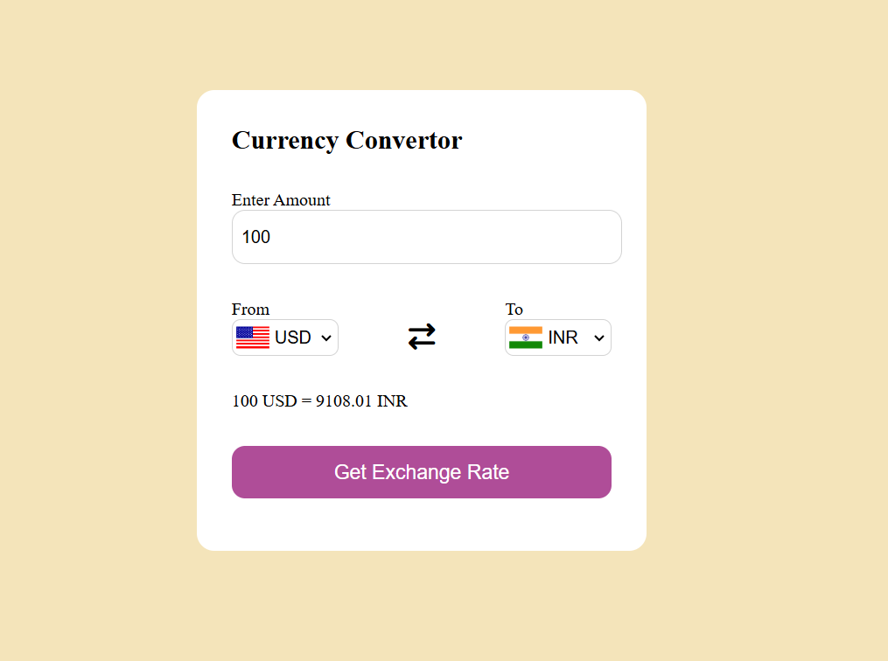

# 💱 Currency Converter

A simple and interactive Currency Converter web application built using HTML, CSS, and JavaScript.  
It fetches real-time exchange rates from a public currency API and allows users to convert between different currencies instantly.

---

## 🚀 Features

- 🔄 Real-time currency conversion using Fetch API
- 🌍 Dynamic country flag updates
- 🧠 Input validation (prevents empty or invalid values)
- 📱 Clean and responsive UI
- ⚡ Built using Vanilla JavaScript (no frameworks)

---

## 🛠️ Technologies Used

- HTML
- CSS
- JavaScript
- Fetch API
- Currency API (latest.currency-api.pages.dev)

---

## 📂 Project Structure
currency-converter/
├── index.html
├── style.css
├── script.js
├── countryList.js
└── README.md

---

## ⚙️ How It Works

1. User selects base currency (From).
2. User selects target currency (To).
3. The app fetches exchange rates for the selected base currency.
4. It extracts the required conversion rate.
5. The final converted amount is displayed dynamically.

---

## 🌐 Live Demo

(Add your GitHub Pages link here after deployment)

---

## 📌 What I Learned

- Working with Fetch API and async/await
- Handling JSON data from APIs
- DOM manipulation using JavaScript
- Difference between `for...in` and `for...of`
- Debugging real-world JavaScript issues

---

## 📸 Preview

---

### ✨ Author
Niyati Pandey
